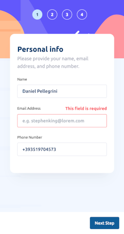

# Frontend Mentor - Multi-step form solution

This is a solution to the [Multi-step form challenge on Frontend Mentor](https://www.frontendmentor.io/challenges/multistep-form-YVAnSdqQBJ) using React Vite and Tailwind CSS.

## Table of contents

- [Overview](#overview)
  - [The challenge](#the-challenge)
  - [Screenshot](#screenshot)
  - [Links](#links)
- [My process](#my-process)
  - [Built with](#built-with)
- [Author](#author)

## Overview

### The challenge

Users should be able to:

- Complete each step of the sequence
- Go back to a previous step to update their selections
- See a summary of their selections on the final step and confirm their order
- View the optimal layout for the interface depending on their device's screen size
- See hover and focus states for all interactive elements on the page
- Receive form validation messages if:
  - A field has been missed
  - The email address is not formatted correctly
  - A step is submitted, but no selection has been made

### Screenshots

  
  

### Links

- Solution URL: [github.com/danielpellegrini/react-multi-step-form](https://github.com/danielpellegrini/react-multi-step-form])
- Live Site URL: [danielpellegrini.github.io/react-multi-step-form](https://danielpellegrini.github.io/react-multi-step-form/)

### Built with

- Semantic HTML5 markup
- Tailwind CSS
- [React](https://reactjs.org/) - JS library

## Author

- Website - [Daniel Pellegrini](https://danielpellegrini.dev)
- Frontend Mentor - [@danielpellegrini](https://www.frontendmentor.io/profile/danielpellegrini)
